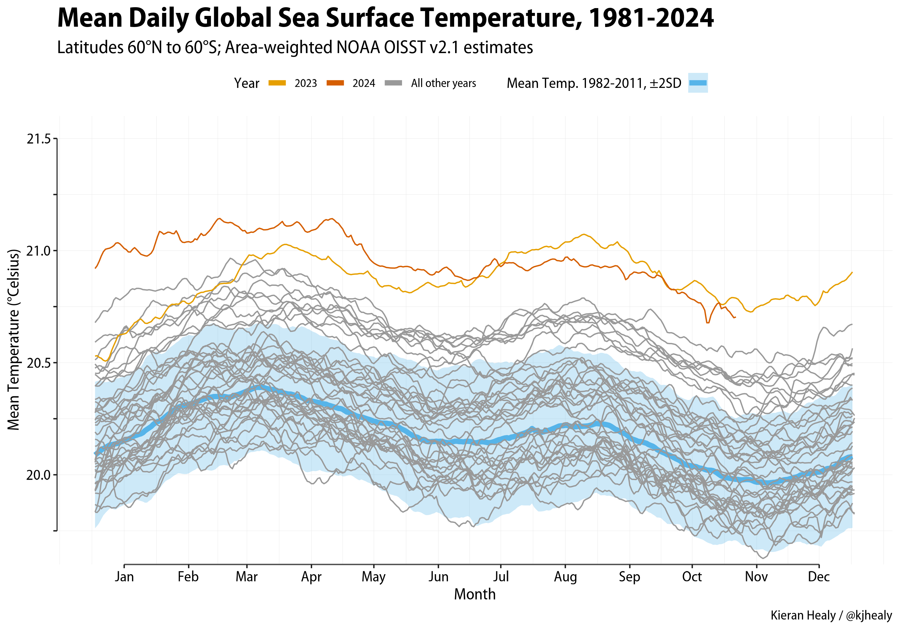
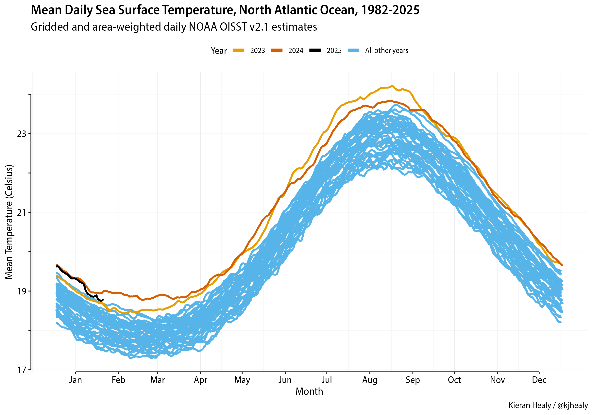

## NOAA Data and graphs

Data obtained with:

mkdir raw
cd raw
wget --no-parent -r -l inf --wait 5 --random-wait 'https://www.ncei.noaa.gov/data/sea-surface-temperature-optimum-interpolation/v2.1/access/avhrr/'

This tries to be polite with the NOAA: enforces a wait time always and in addition randomizes it to make it variably longer. No boundary on depth of folder recursion. There are a lot of files. Doing it this way will take several *days* in real time (much less in actual transfer time of course).

Update a subfolder: 
wget --no-parent -r -l inf --wait 5 --random-wait 'https://www.ncei.noaa.gov/data/sea-surface-temperature-optimum-interpolation/v2.1/access/avhrr/202402'

and remove preliminaries
