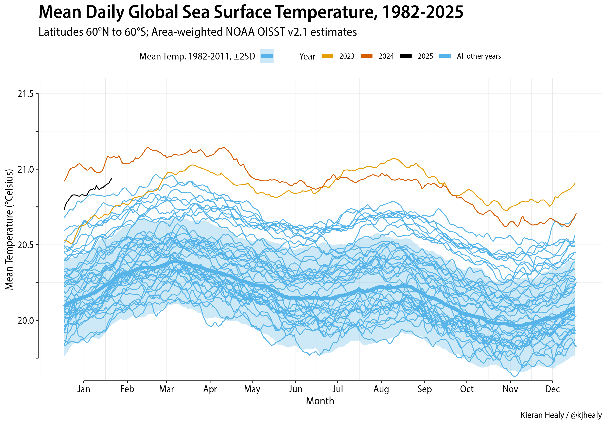

## NOAA Data and graphs




### Getting the data 

Data were originally obtained with:

```bash
mkdir raw
cd raw
wget --no-parent -r -l inf --wait 5 --random-wait 'https://www.ncei.noaa.gov/data/sea-surface-temperature-optimum-interpolation/v2.1/access/avhrr/'
```

This tries to be polite with the NOAA: enforces a wait time always and in addition randomizes it to make it variably longer. No boundary on depth of folder recursion. There are a lot of files. Doing it this way will take several *days* in real time (much less in actual transfer time of course).

Update a subfolder: 

```bash
wget --no-parent -r -l inf --wait 5 --random-wait 'https://www.ncei.noaa.gov/data/sea-surface-temperature-optimum-interpolation/v2.1/access/avhrr/202402'
```

and remove preliminaries. 

### Getting the data from R

Inside `01_setup_data_initial_get.R` is some code to walk the NOAA files politely with `get_nc_files()` and get everything down to a local `raw/` folder. 

Inside `01_setup_data.R` you can see how to use the `get_nc_files()` function to update e.g. a recent month.

